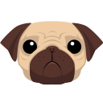
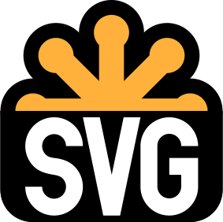
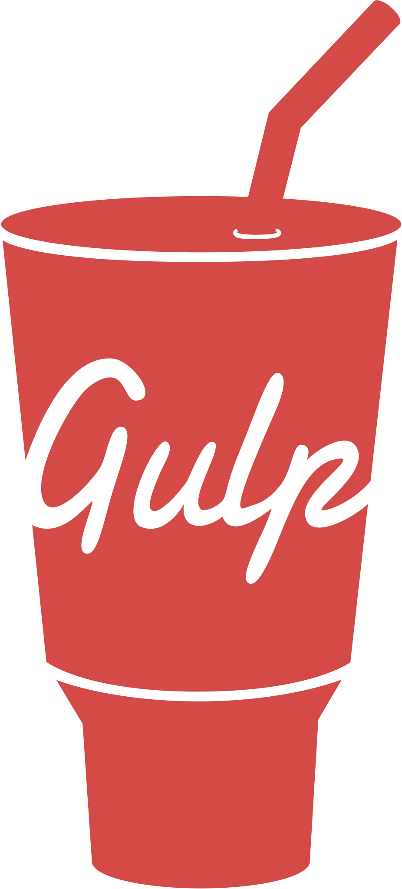
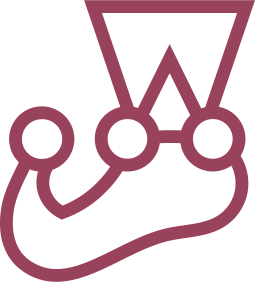

# Hi, I'm Kosty!&nbsp;

## Connect with me:
&nbsp;

&nbsp;

## Tech Stack and Tools

&nbsp;
&nbsp;
&nbsp;
&nbsp;
&nbsp;
&nbsp;
&nbsp;
&nbsp;
&nbsp;
&nbsp;
&nbsp;
&nbsp;
&nbsp;
&nbsp;
&nbsp;
&nbsp;
&nbsp;
&nbsp;
&nbsp;
&nbsp;
&nbsp;
&nbsp;
&nbsp;
&nbsp;
&nbsp;
&nbsp;
&nbsp;
&nbsp;
&nbsp;

## Learning-based projects
+ [GraphiQL](https://meek-starship-470150.netlify.app)  is a playground/IDE for graphQL requests. Work team of 3 members, final practical task of 'The Rolling Scopes School React'.
  > [repo](https://github.com/Veronika2811/graphiql-app/tree/develop)

  > Technology Stack:
  > &nbsp;
  > &nbsp;
  > &nbsp;
  > &nbsp;
  > &nbsp;
  > &nbsp;
  > &nbsp;
  > &nbsp;
  > &nbsp;
+ [The Rolling Scopes School React course's practical tasks](https://github.com/KikinovK/RSS-REACT-2023Q4)
  > Technology Stack:
  > &nbsp;
  > &nbsp;
  > &nbsp;
  > &nbsp;
  > &nbsp;
  > &nbsp;
  > &nbsp;
  > &nbsp;
  > &nbsp;
+ [BUYIT](https://buyit-shop-f.netlify.app/) E-commerce application on the Commerce Tools API - work team of 3 members, final practical task of 'The Rolling Scopes School JS / FRONT-END'.
  > [repo](https://github.com/yevheniiorhanistyi/eCommerce-Application)

  > Technology Stack:
  > &nbsp;
  > &nbsp;
  > &nbsp;
  > &nbsp;
  > &nbsp;
  > &nbsp;
  > &nbsp;
  > &nbsp;
  > &nbsp;
+ [Minesweeper game](https://rolling-scopes-school.github.io/kikinovk-JSFE2023Q1/minesweeper/index.html) - practical task of 'The Rolling Scopes School JS / FRONT-END'.
  > Technology Stack:
  > &nbsp;
  > &nbsp;
  > &nbsp;
  > &nbsp;
+ [Virtual-keyboard](https://kikinovk.github.io/virtual-keyboard/) - practical task of 'The Rolling Scopes School JS / FRONT-END'.
  > [repo](https://github.com/KikinovK/virtual-keyboard/tree/develop)

  > Technology Stack:
  > &nbsp;
  > &nbsp;
  > &nbsp;
  > &nbsp;
+ [Shelter site](https://rolling-scopes-school.github.io/kikinovk-JSFE2023Q1/shelter_dom/index.html) - practical task of 'The Rolling Scopes School JS / FRONT-END'.
  > Technology Stack:
  > &nbsp;
  > &nbsp;
  > &nbsp;
  > &nbsp;
  > &nbsp;
  > &nbsp;
+ [Landing page layout](https://kikinovk.github.io/glivera_test_layout/) - learning task of 'Glivera Teams'.
  > [repo](https://github.com/KikinovK/glivera_test_layout)

  > Technology Stack:
  > &nbsp;
  > &nbsp;
  > &nbsp;
  > &nbsp;
  > &nbsp;
  > &nbsp;
+ [Memory – Pair Game](https://kikinovk.github.io/Memory_Pair_Game/) - practical task of 'Kottans-frontend'.course.
  > [repo](https://github.com/KikinovK/Memory_Pair_Game)

  > Technology Stack:
  > &nbsp;
  > &nbsp;
  > &nbsp;
## Stats

